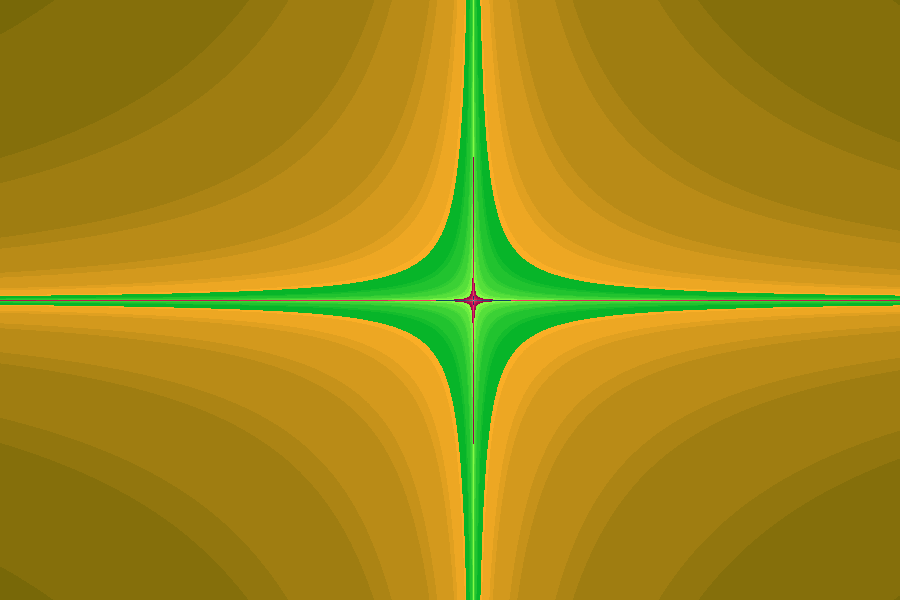

# **Fractal Generator**

An application to generate and explore different types of fractals with CPP, SSE, AVX, and multithreading.

---

## **Table of Contents**

- [Introduction](#introduction)
- [Features](#features)
- [Installation](#installation)
- [Usage](#usage)
     - [Recording Examples](#recording-examples)
- [How It Works](#how-it-works)
- [License](#license)
- [Contact](#contact)

---

## **Introduction**

> `Fractal Generator` is an app that will generate various mathematical fractals.
> Used to explore fractals and the complexity behind them.
> Timing the generation of different fractals using different size registers.
> Uses WinAPI, CPP, SIMD (SSE and AVX), Multithreading

---

## **Features**

- 🚀 Fast and optimized performance.
- ⏳ Algorithm timing.
- 📹 Record fractal exploration for cool gifs.

---

## **Installation**

### Option 1: Run the Executable (For End Users)
If you simply want to use the application without diving into the source code:

1. **Download the Executable**
   - Go to the [Releases](https://github.com/ClarkeNeedles/FractalGenerator/tree/main/x64/Release) section of this repository.
   - Download the latest version of `FractalGenerator.exe`.

2. **Run the Application**
   - Double-click the downloaded `FractalGenerator.exe` file to launch the application.
   - Follow the on-screen prompts or controls to generate your fractals.

> *Note:* The application requires **no additional setup** unless otherwise stated. Make sure your system meets any runtime requirements (see below).

---

### Option 2: Build and Run from Source Code (For Developers)
If you'd like to modify the application or explore the source code:

1. **Prerequisites**
   - Ensure you have the following tools installed:
     - [Visual Studio](https://visualstudio.microsoft.com/) 2019 or later (Windows) with the following components:
       - **.NET Desktop Development Workload** (if applicable).
       - Other required libraries or SDKs (specific details listed below).
     - [Git](https://git-scm.com/) (to clone the repository).

2. **Clone the Repository**
   Open a terminal or Git Bash and clone the repository:
   ```bash
   git clone https://github.com/yourusername/fractal-generator.git
   cd fractal-generator

3. **Open Solution in Visual Studio**
   - Locate the FractalGenerator.sln file in the cloned repository and open it.

4. **Build and Run**
   - Select the desired build configuration (Debug or Release)
   - Press the run button
   - Customize the code as necessary
  
## **Usage**

Here's how to use the Fractal Generator application:

### Step 1: Launch the Application
After running `FractalGenerator.exe`, you'll see the application interface.

### Step 2: Generate Your Fractals
   - Customize fractal parameters (e.g., language, fractal, gradient) and hit "Render" -> "Generate" to render your fractal.
   - The number at the bottom left is the time it took to generate the given fractal.
   - As you move down the list of languages, the generation time will become shorter and shorter.

### Step 3: Explore Your Fractal
   - Left mouse button: move the fractal around
   - Scroll in/out: zooming in and out of the generated fractal

### Recording
   - If you hit "Render" -> "Start Recording" you will start recording.
   - As long as you do not hit end recording, each time an image is generated whether by clicking "Generate", or using your mouse, it will be added to the output gif.

### Recording Examples





## **How It Works**

The **Fractal Generator** allows users to generate various fractals using different computational techniques and languages, harnessing advanced processor capabilities and mathematical equations.

---

### **Languages and Performance Optimization**

- You can generate fractals using several computational methods:
  - **CPP** (C++): Uses generic 64-bit registers.
  - **SSE**: Utilizes single instruction multiple data (SIMD) with 128-bit registers.
  - **AVX**: Leverages SIMD with 256-bit registers for higher parallelism.
  - **Multithreading**: Exploits all the cores in your CPU to further optimize performance.

- **How SIMD Works**:
  - SSE and AVX are SIMD (single instruction, multiple data) technologies that process multiple data points in parallel.
  - Larger registers mean more data can be processed simultaneously:
    - CPP → 64-bit registers.
    - SSE → 128-bit registers.
    - AVX → 256-bit registers.

- **Performance Expectation**:
  - As the size of registers doubles, **generation time is expected to halve** (theoretical maximum).
  - Multithreading combines with SIMD to distribute workload across multiple CPU cores, reducing render times significantly.

---

### **Fractals**

Fractals are intricate geometric shapes generated from mathematical equations, often involving the real and complex number planes. By simulating the number of **iterations** for a given point within the function and **mapping iterations to colors**, the fractals take on visually stunning, uniform patterns.

#### **Types of Fractals**

Here are the types of fractals currently supported by the application:

1. **[Mandelbrot](https://paulbourke.net/fractals/mandelbrot/)**  
   - The classic fractal, defined by the formula \(z_{n+1} = z_n^2 + c\).  

2. **[Burning Ship](https://paulbourke.net/fractals/burnship/)**  
   - A flame-like fractal defined by taking the absolute values of the real and imaginary parts before squaring.  

3. **[Multibrot (Order 5)](https://paulbourke.net/fractals/multimandel/)**  
   - A generalization of the Mandelbrot set using higher powers \((z^5 + c)\).  

4. **[Nova](https://paulbourke.net/fractals/nova/)**  
   - Related to Newton's method for root-finding, resulting in stunning star-shaped geometries.  

5. **[Phoenix](https://en.wikipedia.org/wiki/Julia_set)**  
   - A more chaotic fractal generated using a feedback loop from previous iterations.

---

### **Gradient Mapping**

Gradients in the fractal generator are used to produce dazzling color transitions based on the number of iterations. These gradients manipulate the RGB values dynamically, creating artistic variations in the fractal designs.

---

### **Visual Overview**

Here's a quick breakdown of how everything works together:
1. **Languages**: Choose a computational method (CPP, SSE, AVX, or Multithreading) to optimize performance.
2. **Fractal Equations**: Generate fractals like Mandelbrot, Nova, or Phoenix by mapping iterations to points in the complex plane.
3. **Gradient Mapping**: Add depth and vibrancy by tweaking RGB values, resulting in unique and stunning visuals.

## **License**

This project is licensed under the MIT License. See the [LICENSE](LICENSE) file for details.

## **Contact**

- **Author**: [Clarke Needles](https://your-portfolio-link.com)  
- 📧 Email: [c.w.needles@gmail.com](mailto:c.w.needles@gmail.com)  
- 🌐 Website: [yourwebsite.com](https://yourwebsite.com) 
